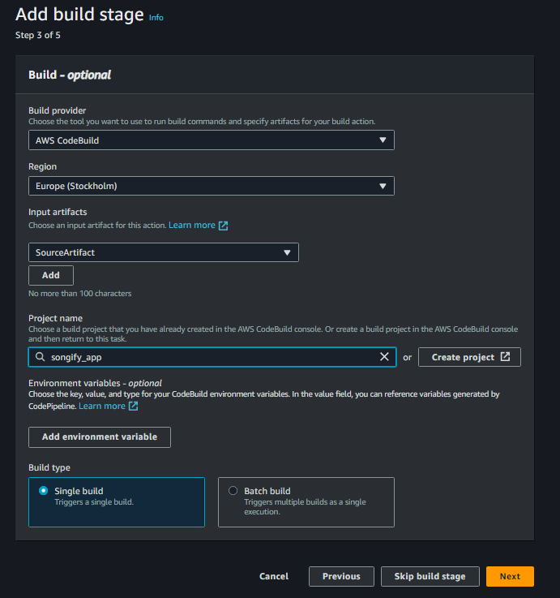

# Song application


# URL
https://13.60.185.16 - This is subject to change if I close down the aws services.

This is a simple song application that allows you to add, and get songs from a database.
Along with XRay to trace the application methods.

## Tutorial - Xray

1. <a href="https://docs.aws.amazon.com/xray/latest/devguide/xray-daemon-local.html#xray-daemon-local-windows">AWS X-Ray
   Daemon</a> is a software application that listens for traffic on UDP port 2000, gathers raw segment data, and relays
   it to the AWS X-Ray API. The daemon works with the AWS X-Ray SDKs and must be running so that the SDKs can send data
   to it.

2. After downloading - Make sure to unzip the file and navigate to the folder in powershell.

3. Run the following command to start the daemon:

```bash
.\xray_windows.exe -o -n eu-north-1
```

> Make sure to have the corresponding dependencies in your project.

# CICD pipeline hosted through GitHub, Codebuild, CodeDeploy, EC2 instance & RDS

## Prerequisites

- AWS account
- GitHub account
- Appspec.yml file in the root directory
- Buildspec.yml file in the root directory
- Security groups for EC2, RDS
- Key pair for EC2
- scripts folder in the root directory with the 4 scripts: install_dependencies.sh, start_server.sh, stop_server.sh,
  test.sh
- A user pool on cognito

> These steps will assume you already have your project set up and ready to be deployed.


## Hosting with EC2, CodeBuild, CodeDeploy, CodePipeline
This is a step for step how to host the application, I chose this hosting method to try out how ENV variables would work with CodeBuild and CodePipeline, along with Github.


1. Make sure you use an IAM user that has AdministratorAccess policy attached to it.
   (this should be sufficient, but you can also add "AmazonEC2FullAccess", "AmazonRDSFullAccess" , "
   AWSCodeDeployFullAccess" & "CloudWatchFullAccess" policies to the user)
2. Create the following roles:
    - {PROJECTNAME}EC2InstanceRole - Add AmazonS3FullAccess to this role
    - {PROJECTNAME}CodeBuildRole- Add AmazonS3FullAccess & AmazonEC2FullAccess
    - {PROJECTNAME}CodeDeployRole
    - {PROJECTNAME}CodePipelineRole

3. Codebuild
Choose the source provider (GitHub) > Manage default source credential >  Choose "Personal access token " & "Codebuild"
 To generate this token go to GitHub > Settings > Developer Settings > Token classic
Once generated enter this into "GitHub personal access token field"
Now choose the repository and enter the branch name - for me, it's "main"
  
Now create the build > Start the build

4. EC2 instance, create the instance - make sure to add the ec2 role you created in advanced settings.

5. RDS instance, create the instance.

6. CodeDeploy, create the app and then the deployment group, make sure to add the CodeDeploy role you created in advanced settings and to choose 
"compute platform" as "ec2/onpremises".
 lastly disable load balancer - then crate deployment.

7. CodePipeline, create the pipeline, choose the source provider (GitHub) > Choose the repository and branch > Next

   (This might be a problem for me since the repo is under an organization, which I will have to be granted access due to no supporting PAT)
 

8. Once the pipeline is created, it will automatically start the build process, and then deploy the application to the EC2 instance.

9. Once you've connected to the instance you will run these commands:
```bash
- sudo yum install java-22-amazon-corretto-headless
- sudo yum install ruby
- wget https://aws-codedeploy-us-east-2.s3.us-east-2.amazonaws.com/latest/install
- chmod +x ./install
- sudo ./install auto
- sudo systemctl status codedeploy-agent
```
10. Now you will have to configure Nginx to serve your application on port 80 and ensured the application uses HTTPS due to cognito requiring it.
This will be done by creating a redirect.conf and also creating self-signed certificates. Dont forget to add ENV variables to the instance.

11. Lastly, you will have to configure the security groups for the EC2 instance to allow traffic on port 80 and 443 and configuring the cognito sign in and sign out urls.


## Hosting with Docker - Using previous steps with EC2 instance
1. Create docker file in root of project:

```Dockerfile
# Use an official Java runtime as a parent image
FROM openjdk:11-jre-slim

# Set the working directory in the container
WORKDIR /app

# Copy the application JAR file into the container
COPY target/songify-0.0.1-SNAPSHOT.jar /app/songify.jar

# Make port 8080 available to the world outside this container
EXPOSE 8080

# Run the JAR file
ENTRYPOINT ["java", "-jar", "/app/songify.jar"]
```

2. Install docker on instance:
   ```bash
   sudo yum update -y
   sudo yum install docker -y
   sudo service docker start
   sudo usermod -a -G docker ec2-user
   ```
3. Build the Docker Image & Run the Docker Container
```bash
docker build -t songify:latest .
docker run -d -p 80:8080 songify:latest
```


## Model Structure

<br />
I decided to keep my model structure simple, and decided to focus on the hosting and pipeline part of the project.

 - I started with creating songs and album as one, but later decided to split them and create a relation between them.


## Summary of hosting methods

### Pros and cons
**Cons**: Both methods are if you ask me, convoluted and unconventional. This is due to some steps being shortcuts. An example of this is the solution with https://, since I don't have a valid certificate. I had to create a fake one on the EC2.
However, there are services that can solve this for example Route 53. This further proves the point that this simple application is way over its head. This app should not need this many services.

**Pros**: While the methods are tedious, they are robust when they're configured correctly. If I push the code I know for sure the Pipeline will trigger, and AWS is a stable cloud provider.


